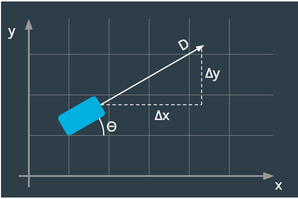
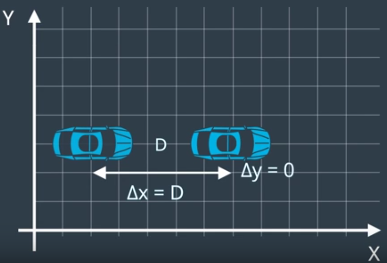
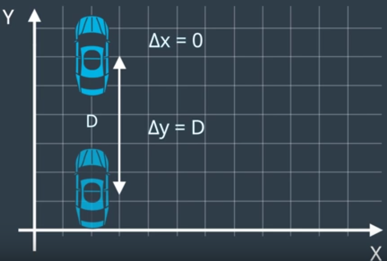

# Trajectory of a car
The picture below captures the goal of this projekt: if you know a car's heading (theta) and distance traveled (D), how can we figure out how far it's moved in the x direction (delta x) and y direction (delta y)?

Before we jump into trigonometry, I want to familiarize you with the Vehicle class you'll be using in this project, In this [notebook](https://github.com/A2Amir/Trajectory-of-a-car/blob/master/motion%20in%20general.ipynb) you have a Vehicle class that has two methods: drive_forward and turn(left or right). Note that this version of a Vehicle class can ONLY face in one of 4 directions: (E)ast, (N)orth, (W)est, or (S)outh.

Beacuse we constrained the car suppose this way((E)ast, (N)orth, (W)est, or (S)outh), it is easey to figure out what is happend when the vehicle moves forward by D meters. for exapmle if we have a car pointing east and moves forward by D meters, we can see the X cordinate just increases by D and Y coordinate does'nt change at all.

 
Or if the car pointing north and then moves forward by D meters, the y coordinate will increase by D and the x coordinate will be left unchanged.

 
But the question is what if the heading is not along X or Y coordinate axis? what if the car pointing at some weired angle like below and moves forward by D meters, what can we say about the value for delta X and for delta Y in a situation like this.

 
d
