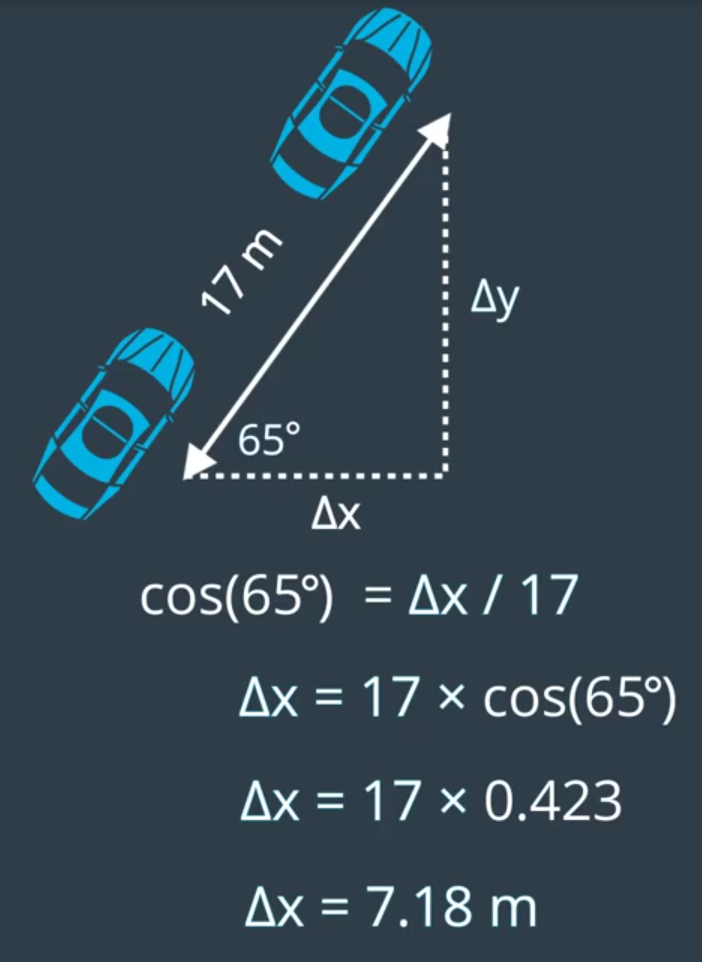

# Trajectory of a car
The picture below captures the goal of this projekt: if you know a car's heading (theta) and distance traveled (D), how can we figure out how far it's moved in the x direction (delta x) and y direction (delta y)?

Before we jump into trigonometry, I want to familiarize you with the Vehicle class you'll be using in this project, In this [notebook](https://github.com/A2Amir/Trajectory-of-a-car/blob/master/motion%20in%20general.ipynb) you have a Vehicle class that has two methods: drive_forward and turn(left or right). Note that this version of a Vehicle class can ONLY face in one of 4 directions: (E)ast, (N)orth, (W)est, or (S)outh.

Beacuse we constrained the car suppose this way((E)ast, (N)orth, (W)est, or (S)outh), it is easey to figure out what is happend when the vehicle moves forward by D meters. for exapmle if we have a car pointing east and moves forward by D meters, we can see the X cordinate just increases by D and Y coordinate does'nt change at all.

 
Or if the car pointing north and then moves forward by D meters, the y coordinate will increase by D and the x coordinate will be left unchanged.

 
But the question is what if the heading is not along x or y coordinate axis? what if the car pointing at some weired angle like below and moves forward by D meters, what can we say about the value for delta x and for delta y in a situation like this.

 
Looking at the diagram above ,if we are going to make scatter plots of position data, we need to know exactly what the value of delta x and delta y are and this will require some trigonometry which is the mathematic of right triangles(because two of the sides meet at aright angle).
**What is amazing about trigonometry is this, if you give an actual numeric value for D in this angle which called theta, delta x and delta y can be calculate exactly. But befor calculating for any angle or any displacement we are going to start with some very specific values.**

for example i am goning to pick theta to be fifty three point one three degrees(53.13) and D is going to be five meters and the reason for picking these numbers is because it turns out that when acr with a heading of fifty three point one three(53.13) degrees moves forward by five meters, if you measure delta x and delta y  you fund they are equal three meters and four meters.

 
 You saw earlier that if D=5, then Delta x = 3 and Delta y= 4 but If D = 10 meters "Delta x" would be 6 meters and "Delta y"  would be 8 meters then we can canclude 
**When driving at a heading of 53.13 degrees, the ratio of a car's vertical displacement to its total displacement will always equal 4/5**

we just calculated the following values for a vehicle with a heading of 53.13 degrees

        
 | D   | Δy | Δx|
 | --  | -- |-- |
 | 5 |	4 	|3|
 |10| 8 	|6|
 |1 |4/5	|3/5|

But really, for this particular angle we can say something much more general. We can say:

    Δy=4/5×D
    Δx=3/5×D

And these are very useful equations! They tell us that the vertical displacement is equal to total displacement times some multiplier (in this case 4/5). Likewise, horizontal displacement is total displacement times some other multiplier (in this case 3/5).
 
**That is just one angle what if we are driving with a heading of 27.2 degree or negative 112.5? how we can calculate delta x and delta y in those situations? we would like to use a multipliers just we did with three and four and five triangle (above). the trig gives us a way to easy calculate mutipliers for any angle**

the first thing we need is a naming convention for talking about the size of a right triangle:
* the longest side of the right triangle is called the hypotenuse side.
* the side on the right, the one that is opposit the reference angle(theta) called the opposite side.
* the last remaining side, that is next to the reference angle called the adjecent side

 
Now we can talk about the sides of a right triangle using words like opposite, hypotenuse, adjacent and the ratios of those sides. the trigonomertic ratios are called sine,cosine and tangent.

The sine, cosine, and tangent are all trigonometric ratios. A helpful mnemonic for remembering which sides each of these ratios compare is SOH - CAH - TOA

 
There are [three ways](https://github.com/A2Amir/Trajectory-of-a-car/blob/master/Looking%20up%20Trig%20Ratios.ipynb) you could find the value of a trig function at a particular angle. but remember our initial problem,given the vehicles heading angle and displacement and calculate delta x and delta y, now we can solve the problem by instead thinking about a vehicle and a displacement we just think about a right triangle and change our problem to given a right trangle's reference and hypotenuse then calculate the lengths of the adjacent and opposite sides.
 
for example, we have a vehicle with a heading of 65 degrees and displacement of 17 meters:
To find out the 'x', 

* First I draw the right triangle with a reference angle(theta) of 65 degrees. 
* Next I identify the known(the hypotenuse with the length of 17 meters) and unknown(adjacent and opposite) sides of the triangle.
* Now I want to find the trigonometric ratio that relates the known and unknown sides(because we want to find delta x we are looking for the ratio that relates the hypotenuse to the adjacent which is the cosine).

* The last thing to do is rearrange this equation to get delta x alone.

 
 
Now that you know how to solve trigonometry problems, you can keep track of a vehicle's xand y coordinates as it moves in any direction. you can  [here](https://github.com/A2Amir/Trajectory-of-a-car/blob/master/KeepingTrackofxandy(Amir).ipynb) the ralted code.

 
